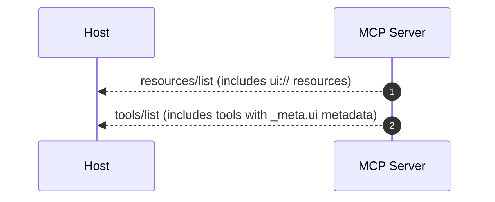
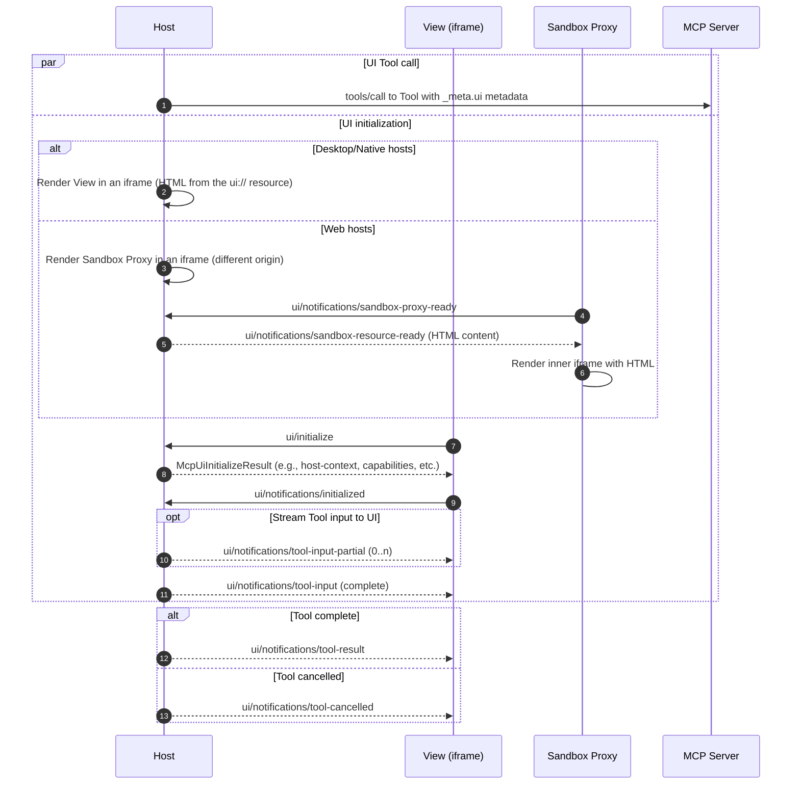
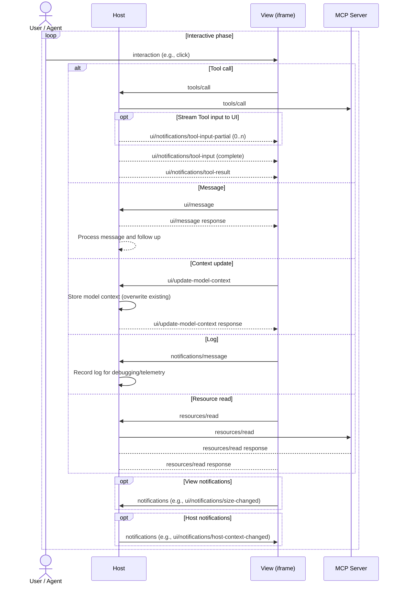
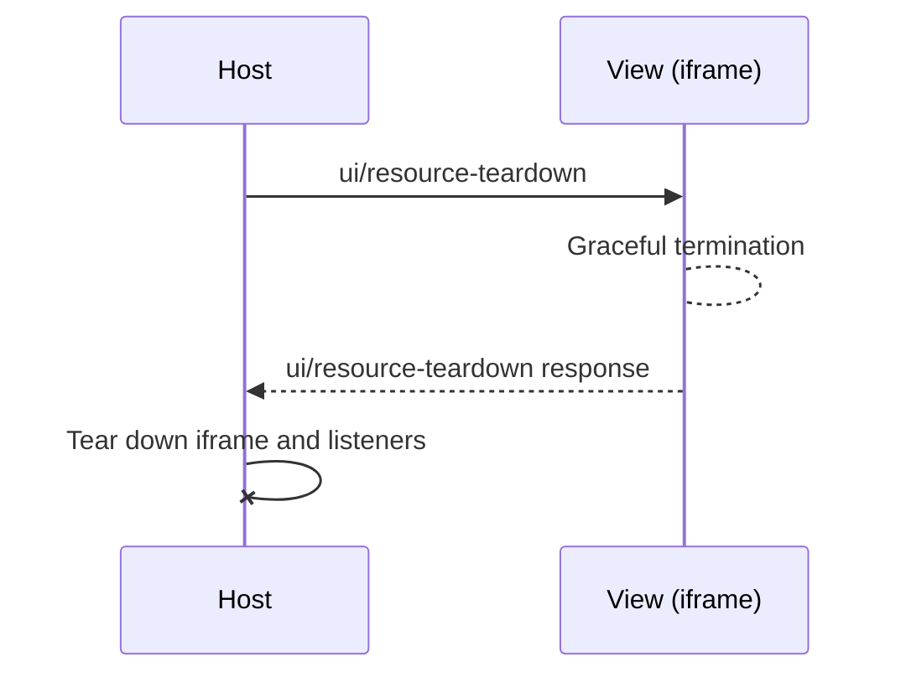

# MCP Apps (10) — Self-Contained Protocol + SDK Digest

| Field           | Value |
|-----------------|-------|
| Pinned SDK      | `@modelcontextprotocol/ext-apps` v1.7.2 |
| Spec revision   | 2026-01-26 (SEP-1865, status: Stable) |
| Upstream commit | `9a37ad7` |
| Regenerated     | 2026-05-16 |
| Draft state     | A non-empty `specification/draft/apps.mdx` exists upstream — it adds a "Metadata Location" |
|                 | clarification (resource-level `_meta.ui` may also appear in `resources/list`, content-item value |
|                 | takes precedence) and softens two sandbox-proxy MUSTs to SHOULDs. The digest documents the Stable |
|                 | revision; treat the draft as informative only. |

This file is the single self-contained reference for MCP Apps (UI-augmented MCP tools) used by
`fa-mcp-sdk`-based servers. It supersedes routine lookups into the upstream repository. Use the
Reference Index at the end of the document when source-of-truth is needed.

## 2. What & Why

An **MCP App** is a Tool + UI Resource pair linked through tool `_meta.ui.resourceUri`. The tool's
`content` text array MUST still exist so that hosts without MCP Apps support continue to work — the
UI is a progressive enhancement, never a replacement. The host fetches the referenced `ui://` HTML
resource, renders it inside a sandboxed iframe (the **View**), and proxies bidirectional JSON-RPC
between View and MCP server. The View can call server tools, read resources, request display-mode
changes, send chat messages, or push model-context updates.

This solves three problems with text-only MCP responses: (a) lack of standardized UI delivery across
hosts (MCP-UI vs. OpenAI Apps SDK fragmentation), (b) inconsistent security models for embedded
content, and (c) inability to ship rich interactive surfaces (dashboards, players, forms, maps)
through the protocol.

### Hosts that ship with this SDK

`fa-mcp-sdk` includes **Agent Tester** (`/agent-tester`) — a developer-grade MCP Apps host. Toggle
the `Apps` checkbox in the header to advertise UI capability on the MCP `initialize` handshake;
returned widgets render inline under each chat message, Tool Tester gains a split-view raw/UI
panel, and a dedicated **App Inspector** tab surfaces every `ui/*` JSON-RPC frame for debugging.
The same `appMode: true` flag is accepted on the headless `POST /api/chat/test` endpoint so
automated tests can assert both text-only and UI-augmented behaviors of the same tool in one
suite. See [08-agent-tester-and-headless-api.md](08-agent-tester-and-headless-api.md) → "MCP Apps
Mode" for the full surface (capability negotiation, `appCalls[]` / `app_calls[]`, the
`/api/mcp/ui-resources` endpoint, security trade-offs of desktop-style hosting).

This is intentionally a **dev-tool host** — for production MCP App rendering use Claude Desktop,
Claude.ai, or another spec-compliant host listed below.

### Canonical example

A minimal, runnable reference lives at `examples/mcp-apps-canonical/`:

```bash
npm run example:mcp-apps     # starts on :7080
# then open http://localhost:7080/agent-tester, toggle Apps, ask "what time is it?"
```

The example is the smallest possible MCP Apps server (one tool, one widget, no
build step) and is the canonical reference for the `mcp-app-create` and
`mcp-app-add-to-server` skills. Copy the three patterns documented in its
README when wiring MCP Apps into your own project. The structure intentionally
uses `fa-mcp-sdk`'s `initMcpServer` + `customResources` instead of
`registerAppTool`/`registerAppResource` so it shares the same auth, transport,
and logging plumbing as every other tool you ship.

## 3. Architecture

Three entities cooperate over two transports:

```
+-----------+   MCP (HTTP/SSE/stdio)   +--------+   postMessage / JSON-RPC   +-----------------+
| MCP       |<------------------------>|  Host  |<-------------------------->| View (iframe)   |
| Server    |                          |        |                            |  = App instance |
+-----------+                          +--------+                            +-----------------+
```

- **Server** — a standard MCP server that registers tools whose `_meta.ui.resourceUri` points to a
  `ui://` HTML resource. Built with `registerAppTool` / `registerAppResource` from
  `@modelcontextprotocol/ext-apps/server`.
- **Host** — the chat client (Claude Desktop, Claude.ai, VS Code Insiders, Goose, etc.). Connects
  to the server, renders the View, and proxies all View→server messages.
- **View** — the HTML/JS payload returned by the UI resource. Acts as an MCP client over
  `PostMessageTransport`. Built around the `App` class from `@modelcontextprotocol/ext-apps`.

**Sandbox model.** Desktop/native hosts render the View directly in a sandboxed iframe. Web hosts
MUST insert an intermediate Sandbox Proxy iframe on a different origin from the host
(`allow-scripts allow-same-origin`); the proxy receives the raw HTML over
`ui/notifications/sandbox-resource-ready`, applies CSP/permissions, and transparently forwards every
non-`ui/notifications/sandbox-*` message between the inner View and the Host. The Host MUST NOT send
any message to the View before receiving `ui/notifications/initialized`.

**Capability negotiation.** The host advertises MCP Apps support via the
`io.modelcontextprotocol/ui` extension key in `initialize.capabilities.extensions`, declaring at
minimum the supported `mimeTypes` (`text/html;profile=mcp-app`). Servers SHOULD call
`getUiCapability(clientCapabilities)` before registering UI-enabled tools and MUST provide a
text-only fallback for hosts that don't support the extension.

## 4. Lifecycle

All four sequence diagrams below are reproduced verbatim from
`specification/2026-01-26/apps.mdx` § Lifecycle. They are the canonical message-order contract — do
not paraphrase, derive, or fold.

### 4.1 Connection & Discovery



### 4.2 UI Initialization (Desktop/Native Hosts)



Note: when the View is rendered inside a sandbox, the sandbox transparently passes messages between
the View and the Host, except for messages named `ui/notifications/sandbox-*`.

### 4.3 Interactive Phase



### 4.4 Cleanup



Cleanup may be triggered at any point after initialization (user navigates away, host re-allocates
the slot, app calls `requestTeardown`). The host SHOULD wait for the View's response before
unmounting to prevent data loss.

## 5. Protocol Contract

Normative passages reuse the spec's MUST / SHOULD / MAY wording.

### 5.1 `ui://` URI scheme + `RESOURCE_MIME_TYPE`

- Every UI resource URI MUST start with `ui://`.
- The `mimeType` of a UI resource MUST be `text/html;profile=mcp-app`
  (exported as `RESOURCE_MIME_TYPE` from `@modelcontextprotocol/ext-apps/server`). Other MIME types
  are reserved for future extensions.
- Resource content MUST be returned via either `text` (string) or `blob` (base64) and MUST be a
  valid HTML5 document.
- Hosts MAY prefetch and cache UI resource content. Since UI resources are primarily discovered
  through tool metadata, servers MAY omit UI-only resources from `resources/list` and
  `notifications/resources/list_changed`.

### 5.2 `_meta.ui` location matrix

| Where | Key | What it carries |
|-------|-----|------------------|
| Tool definition | `tool._meta.ui` | `McpUiToolMeta`: `resourceUri`, `visibility: ("model"\|"app")[]` |
| Tool definition (legacy) | `tool._meta["ui/resourceUri"]` | Deprecated flat form; SDK auto-mirrors with the |
|                          |                                | nested form for backward compatibility |
| Resource entry | `resource._meta.ui` | `McpUiResourceMeta` listing-level default (`csp`, `permissions`, |
|                |                     | `domain`, `prefersBorder`) |
| Resource content item | `contents[i]._meta.ui` | `McpUiResourceMeta` — takes precedence over the listing-level |
|                       |                        | value when both are present |

Servers SHOULD place `_meta.ui` on the content item in `resources/read` for dynamic per-response
metadata; the listing-level `_meta.ui` is for static, reviewable defaults.

`visibility` defaults to `["model", "app"]`. `"model"`-only tools never appear in app-issued
`tools/call`s; `"app"`-only tools are excluded from the agent's `tools/list` and are callable only
through `app.callServerTool(...)` from the View. Cross-server tool calls are always blocked for
app-only tools.

### 5.3 Capability negotiation

Host advertises support in the standard `initialize` capabilities envelope:

```json
{
  "capabilities": {
    "extensions": {
      "io.modelcontextprotocol/ui": { "mimeTypes": ["text/html;profile=mcp-app"] }
    }
  }
}
```

Servers MUST use `getUiCapability(clientCapabilities)` (or equivalent) before registering UI-enabled
tools, and SHOULD register text-only fallback tool variants when the capability is absent. Tools
MUST return a meaningful `content[]` even when UI rendering is available.

### 5.4 Content Security Policy

The host MUST construct CSP headers from `_meta.ui.csp`. If `_meta.ui.csp` is absent, the host MUST
apply the restrictive default:

```
default-src 'none';
script-src 'self' 'unsafe-inline';
style-src 'self' 'unsafe-inline';
img-src 'self' data:;
media-src 'self' data:;
connect-src 'none';
```

Hosts MAY further restrict but MUST NOT permit undeclared domains. `McpUiResourceCsp` fields map
directly to CSP directives:

| Field | Directive(s) | Default when omitted |
|-------|--------------|----------------------|
| `connectDomains[]` | `connect-src` | `'none'` (no fetch/XHR/WebSocket) |
| `resourceDomains[]` | `img-src`, `script-src`, `style-src`, `font-src`, `media-src` | `'self' data:` for media/img |
| `frameDomains[]` | `frame-src` | `'none'` |
| `baseUriDomains[]` | `base-uri` | `'self'` |

`_meta.ui.permissions` (`camera`, `microphone`, `geolocation`, `clipboardWrite`) maps to the
iframe's `allow` Permission-Policy attribute; hosts MAY honor or deny these. Apps SHOULD use JS
feature detection rather than assume a permission was granted.

`_meta.ui.domain` provides a stable sandbox origin for CORS allowlisting or OAuth callbacks. The
exact format is **host-dependent** — hosts publish their own subdomain conventions (Claude uses
`{hash}.claudemcpcontent.com`, OpenAI uses `www-{domain}-com.oaiusercontent.com`).

### 5.5 Host ↔ View JSON-RPC messages

Lifecycle:

| Method | Direction | Kind | Purpose |
|--------|-----------|------|---------|
| `ui/initialize` | View → Host | Request | Handshake; carries `appInfo`, `appCapabilities`, `protocolVersion` |
| `ui/notifications/initialized` | View → Host | Notification | View signals readiness for tool input/result |
| `ping` | Either | Request | Connection health check |

Tool input/output (Host → View):

| Method | Kind | Notes |
|--------|------|-------|
| `ui/notifications/tool-input-partial` | Notification | MAY be sent 0..n times during agent streaming. Arguments |
|                                       |              | are healed JSON (unclosed brackets auto-closed). Views MAY |
|                                       |              | ignore; MUST NOT use for critical operations. |
| `ui/notifications/tool-input` | Notification | MUST be sent exactly once after `ui/initialize` completes and |
|                               |              | before `ui/notifications/tool-result`. Carries complete |
|                               |              | tool arguments. |
| `ui/notifications/tool-result` | Notification | MUST be sent when tool execution completes (if the View is |
|                                |              | displayed). `params` is the standard `CallToolResult`. |
| `ui/notifications/tool-cancelled` | Notification | MUST be sent on cancellation (user, sampling error, |
|                                   |              | classifier intervention). `params: { reason: string }`. |

Host ↔ View runtime:

| Method | Direction | Kind | Notes |
|--------|-----------|------|-------|
| `tools/call` | View → Host (proxied to Server) | Request | Standard MCP. Issued via `App.callServerTool`. |
| `resources/read` | View → Host (proxied to Server) | Request | Standard MCP. |
| `resources/list` | View → Host (proxied to Server) | Request | Standard MCP. |
| `sampling/createMessage` | View → Host | Request | Standard MCP sampling, gated by `hostCapabilities.sampling`. |
| `notifications/message` | View → Host | Notification | Standard MCP log (debug/telemetry, not chat). |
| `ui/message` | View → Host | Request | Send `{ role, content }` to the conversation. Host SHOULD add |
|              |             |         | to context, MAY ask for user consent. |
| `ui/update-model-context` | View → Host | Request | Replaces previous View-issued model context. Host MAY |
|                           |             |         | dedupe; only the last update before the next user turn |
|                           |             |         | reaches the model. |
| `ui/open-link` | View → Host | Request | Open URL in user's default browser. Host MAY deny. |
| `ui/request-display-mode` | View → Host | Request | Request switch to `"inline"\|"fullscreen"\|"pip"`. Result |
|                           |             |         | returns the actual mode (may differ from request). |
| `ui/notifications/size-changed` | View → Host | Notification | View reports current viewport size in px. SDK sends this |
|                                 |             |              | automatically via `ResizeObserver` when `autoResize: true`. |
| `ui/notifications/host-context-changed` | Host → View | Notification | `Partial<HostContext>`; View MUST merge with current |
|                                          |             |              | context. |
| `ui/resource-teardown` | Host → View | Request | Host MUST send before unmounting. Host SHOULD await the |
|                        |             |         | response to prevent data loss. |

Sandbox-proxy reserved (web hosts only):

| Method | Direction | Kind | Notes |
|--------|-----------|------|-------|
| `ui/notifications/sandbox-proxy-ready` | Proxy → Host | Notification | Proxy is alive and ready for HTML. |
| `ui/notifications/sandbox-resource-ready` | Host → Proxy | Notification | Carries the HTML payload plus inline `csp` / |
|                                            |              |              | `permissions` for the inner iframe. |

SDK-only extensions (present in `@modelcontextprotocol/ext-apps` v1.7.2 but not yet promoted into
the Stable spec): `ui/download-file` (View → Host request for host-mediated file download) and
`ui/notifications/request-teardown` (View → Host notification asking the host to initiate teardown,
after which the host follows up with the standard `ui/resource-teardown` request). Hosts that
predate these messages MAY reject or ignore them; treat both as best-effort.

### 5.6 Capability shapes

```ts
interface McpUiAppCapabilities {
  experimental?: {};
  tools?: { listChanged?: boolean };
  availableDisplayModes?: Array<"inline" | "fullscreen" | "pip">;
}

interface McpUiHostCapabilities {
  experimental?: {};
  openLinks?: {};
  downloadFile?: {};
  serverTools?: { listChanged?: boolean };
  serverResources?: { listChanged?: boolean };
  logging?: {};
  sandbox?: {
    permissions?: { camera?: {}; microphone?: {}; geolocation?: {}; clipboardWrite?: {} };
    csp?: McpUiResourceCsp;
  };
  updateModelContext?: McpUiSupportedContentBlockModalities;
  message?: McpUiSupportedContentBlockModalities;
  sampling?: { tools?: {} };
}
```

Views MUST declare every display mode they can render in `appCapabilities.availableDisplayModes`.
Hosts MUST NOT switch a View to a mode that is not declared, MUST return the resulting (possibly
unchanged) mode in `ui/request-display-mode` responses, and MAY decline mode requests that the View
did not declare.

## 6. TypeScript SDK API

All snippets below assume:

```ts
import { App, PostMessageTransport } from "@modelcontextprotocol/ext-apps";
import {
  registerAppTool, registerAppResource, getUiCapability,
  RESOURCE_MIME_TYPE, RESOURCE_URI_META_KEY,
} from "@modelcontextprotocol/ext-apps/server";
```

### 6.1 Server helpers

`registerAppTool(server, name, config, callback)` — wraps `server.registerTool` and normalizes
`_meta.ui.resourceUri` ↔ `_meta["ui/resourceUri"]` for backward compatibility. `config._meta.ui`
MAY contain `resourceUri` and `visibility: ("model"|"app")[]`.

```ts
registerAppTool(
  server,
  "get-weather",
  {
    title: "Get Weather",
    description: "Current weather with interactive dashboard",
    inputSchema: { location: z.string() },
    _meta: { ui: { resourceUri: "ui://weather/view.html" } },
  },
  async ({ location }) => {
    const w = await fetchWeather(location);
    return { content: [{ type: "text", text: JSON.stringify(w) }], structuredContent: w };
  },
);
```

`registerAppResource(server, name, uri, config, readCallback)` — defaults `mimeType` to
`RESOURCE_MIME_TYPE`. Put `_meta.ui.csp` / `_meta.ui.domain` / `_meta.ui.prefersBorder` on the
`contents[]` returned by `readCallback`, not in `config`.

```ts
registerAppResource(
  server,
  "Weather View",
  "ui://weather/view.html",
  { description: "Interactive weather display" },
  async () => ({
    contents: [{
      uri: "ui://weather/view.html",
      mimeType: RESOURCE_MIME_TYPE,
      text: await fs.readFile("dist/view.html", "utf-8"),
      _meta: { ui: { csp: { connectDomains: ["https://api.openweathermap.org"] }, prefersBorder: true } },
    }],
  }),
);
```

`getUiCapability(clientCapabilities)` returns the `McpUiClientCapabilities | undefined` payload from
the host's `extensions["io.modelcontextprotocol/ui"]`. Use it in `server.server.oninitialized` to
gate which tool variant to register.

`RESOURCE_MIME_TYPE === "text/html;profile=mcp-app"`. `RESOURCE_URI_META_KEY === "ui/resourceUri"`
(legacy flat key, prefer the nested `_meta.ui.resourceUri` form).

### 6.1.1 Reading client capabilities from fa-mcp-sdk

`fa-mcp-sdk` re-implements the read side of MCP Apps capability negotiation inline so the SDK does
**not** take a hard runtime dependency on `@modelcontextprotocol/ext-apps`. Consumers who only need
to branch tool behavior on UI support (and don't register `ui://` resources directly through
ext-apps helpers) can stay on the SDK exports alone.

```ts
import {
  getUiCapability, hostSupportsMcpApps,
  MCP_APPS_EXTENSION_ID, MCP_APPS_RESOURCE_MIME_TYPE,
  IClientCapabilities, IMcpUiClientCapabilities,
  IToolHandlerParams,
} from 'fa-mcp-sdk';
```

| Export | Equivalent in `@modelcontextprotocol/ext-apps/server` | Notes |
|--------|--------------------------------------------------------|-------|
| `getUiCapability(caps)` | `getUiCapability` | Returns `IMcpUiClientCapabilities \| undefined`. |
| `hostSupportsMcpApps(caps)` | — (convenience predicate on top of `getUiCapability`) | `true` ⇔ host advertised `text/html;profile=mcp-app` in `mimeTypes`. |
| `MCP_APPS_EXTENSION_ID` | `EXTENSION_ID` (`"io.modelcontextprotocol/ui"`) | Key under `capabilities.extensions`. |
| `MCP_APPS_RESOURCE_MIME_TYPE` | `RESOURCE_MIME_TYPE` (`"text/html;profile=mcp-app"`) | MIME the host MUST receive for `ui://` resources. |
| `IClientCapabilities` | — | `ClientCapabilities & { extensions?: Record<string, unknown> }`. |
| `IMcpUiClientCapabilities` | `McpUiClientCapabilities` | `{ mimeTypes?: string[]; [k: string]: unknown }`. |

`params.clientCapabilities` is populated automatically on every tool / prompt / resource call:

| Transport | Source | Availability |
|-----------|--------|--------------|
| STDIO | `Server.getClientCapabilities()` (low-level SDK) read inside every handler in `createMcpServer()`. | Every call. |
| SSE | Same as STDIO, but resolved per-connection (each SSE session owns its own `Server`). | Every call. |
| Streamable HTTP | Same as STDIO — each session owns its own `Server` + `StreamableHTTPServerTransport` (stateful, keyed by `Mcp-Session-Id`, in-memory `Map` with soft FIFO cap of 4096 sessions). `getClientCapabilities()` is read per handler. | Every call within a session. A client that never sends `Mcp-Session-Id` cannot make post-`initialize` calls (→ 400), so handlers still treat `undefined` as text-only. |

```ts
export const handleToolCall = async (params: IToolHandlerParams) => {
  const uiCap = getUiCapability(params.clientCapabilities);
  const supportsUi = !!uiCap?.mimeTypes?.includes(MCP_APPS_RESOURCE_MIME_TYPE);
  //                                ^ or: hostSupportsMcpApps(params.clientCapabilities)

  if (supportsUi) {
    return {
      content: [{ type: 'text', text: renderTextSummary() }],   // text fallback is MANDATORY
      _meta: { ui: { resourceUri: 'ui://my/view.html' } },
    };
  }
  return formatToolResult({ message: renderTextSummary() });    // pure text path
};
```

The `ITransportContext` passed to dynamic `customPrompts(ctx)` / `customResources(ctx)` carries the
same `clientCapabilities` field — use it to filter which prompts/resources to advertise per host.

When you also need to **register** `ui://` resources with ext-apps' helper conventions (preferred
for new MCP Apps), keep using `@modelcontextprotocol/ext-apps/server` directly — the SDK exports
above only cover the capability-read path.

### 6.2 `App` class (View side)

Constructor: `new App(appInfo, capabilities = {}, options = { autoResize: true })`.

`AppOptions`:

| Option | Default | Effect |
|--------|---------|--------|
| `autoResize` | `true` | Observes `<html>` / `<body>` and sends `ui/notifications/size-changed` automatically |
| `strict` | `false` | When `true`, calling host-bound methods before `connect()` resolves throws instead of |
|          |         | logging a `console.warn`. Will become the default in a future release. |
| `allowUnsafeEval` | `false` | When `false`, sets `z.config({ jitless: true })` so zod parsing works under the |
|                   |         | spec's default CSP (which disallows `unsafe-eval`). |

Connection: `await app.connect(transport?, options?)`. Defaults to
`new PostMessageTransport(window.parent, window.parent)`. Performs `ui/initialize` →
`ui/notifications/initialized` handshake, caches host capabilities/info/context, and (if
`autoResize`) attaches the `ResizeObserver`. On failure the transport is closed and the error
re-thrown.

Outbound requests/notifications (host-bound; all assert that `connect()` has completed):

| Method | Sends | Returns |
|--------|-------|---------|
| `callServerTool(params, opts?)` | `tools/call` | `CallToolResult` (check `result.isError`) |
| `readServerResource(params, opts?)` | `resources/read` | `ReadResourceResult` |
| `listServerResources(params?, opts?)` | `resources/list` | `ListResourcesResult` |
| `createSamplingMessage(params, opts?)` | `sampling/createMessage` | `CreateMessageResult` (or `…WithTools`) |
| `sendMessage(params, opts?)` | `ui/message` | `McpUiMessageResult` |
| `updateModelContext(params, opts?)` | `ui/update-model-context` | `{}` |
| `openLink(params, opts?)` | `ui/open-link` | `{ isError?: true }` |
| `downloadFile(params, opts?)` | `ui/download-file` (SDK-only) | `{ isError?: true }` |
| `requestDisplayMode(params, opts?)` | `ui/request-display-mode` | `{ mode }` |
| `requestTeardown(params?)` | `ui/notifications/request-teardown` notification | — |
| `sendSizeChanged(params)` | `ui/notifications/size-changed` notification | — |
| `sendLog(params)` | `notifications/message` notification | — |
| `sendToolListChanged(params?)` | `notifications/tools/list_changed` notification | — |

Inspection: `getHostCapabilities()`, `getHostVersion()` (returns `Implementation`),
`getHostContext()` (auto-merged from `ui/notifications/host-context-changed`).

Host-driven event handlers. Register **before** `app.connect()` to avoid missing one-shot events
like `ui/notifications/tool-result`. The DOM-style `on*` setters work but are JSDoc-deprecated in
favor of `app.addEventListener(event, handler)` / `removeEventListener` for composition + cleanup.
`onteardown` and the tool-server handlers (`oncalltool`, `onlisttools`) remain regular request
handlers.

| Setter | Event name | Payload |
|--------|------------|---------|
| `app.ontoolinput` | `"toolinput"` | `McpUiToolInputNotification["params"]` |
| `app.ontoolinputpartial` | `"toolinputpartial"` | `McpUiToolInputPartialNotification["params"]` |
| `app.ontoolresult` | `"toolresult"` | `CallToolResult` (the spec's `ui/notifications/tool-result` params) |
| `app.ontoolcancelled` | `"toolcancelled"` | `{ reason: string }` |
| `app.onhostcontextchanged` | `"hostcontextchanged"` | `Partial<McpUiHostContext>` |
| `app.onteardown` | (request) `ui/resource-teardown` | Async `() => McpUiResourceTeardownResult` |
| `app.oncalltool` | (request) `tools/call` | App-as-tool-server handler |
| `app.onlisttools` | (request) `tools/list` | App-as-tool-server handler |

App-as-tool-server: `app.registerTool(name, config, callback)` declares View-exposed tools that the
host (or its LLM) may call into the iframe. Tools auto-register `capabilities.tools` when no value
is provided. Use `app.sendToolListChanged()` after dynamic enable/disable.

### 6.3 `PostMessageTransport`

```ts
// In a View:
const transport = new PostMessageTransport(window.parent, window.parent);
await app.connect(transport);

// In a Host:
const transport = new PostMessageTransport(iframe.contentWindow!, iframe.contentWindow!);
```

`eventSource` is validated against `event.source` and is required for security — messages from
unknown windows are dropped silently. Outbound `postMessage` uses `"*"` as the target origin;
receivers MUST validate the source themselves. Non-JSON-RPC messages and JSON-RPC `2.0` messages
that fail `JSONRPCMessageSchema` validation are dropped / surfaced via `onerror`.

### 6.4 Style helpers (framework-agnostic)

```ts
import {
  applyDocumentTheme, applyHostStyleVariables, applyHostFonts, getDocumentTheme,
} from "@modelcontextprotocol/ext-apps";

if (ctx.theme) applyDocumentTheme(ctx.theme);                              // sets data-theme + color-scheme
if (ctx.styles?.variables) applyHostStyleVariables(ctx.styles.variables);  // sets CSS custom properties
if (ctx.styles?.css?.fonts) applyHostFonts(ctx.styles.css.fonts);          // injects <style id="__mcp-host-fonts">
const current = getDocumentTheme();                                         // "light" | "dark"
```

`applyHostFonts` is idempotent (no-op if `<style id="__mcp-host-fonts">` already exists). All three
SHOULD be called once on `connect()` *and* re-applied inside `onhostcontextchanged`.

### 6.5 React hooks

```ts
import {
  useApp, useHostStyles, useHostStyleVariables, useHostFonts,
  useDocumentTheme, useAutoResize,
} from "@modelcontextprotocol/ext-apps/react";
```

| Hook | Signature | Notes |
|------|-----------|-------|
| `useApp(options)` | `{ appInfo, capabilities, onAppCreated?, autoResize?, strict? }` → `{ app, isConnected, error }` | Creates the |
|                   |                                                                                                  | `App`, wires the |
|                   |                                                                                                  | `PostMessageTransport` to `window.parent`, calls |
|                   |                                                                                                  | `onAppCreated(app)` **before** `connect()`. Does |
|                   |                                                                                                  | NOT re-run on options changes; does NOT close on |
|                   |                                                                                                  | unmount (Strict-Mode safe). |
| `useHostStyles(app, initialContext?)` | composite | Combines `useHostStyleVariables` + `useHostFonts`. |
| `useHostStyleVariables(app, initialCtx?)` | applies vars + `applyDocumentTheme` on mount and on |
|                                            | `hostcontextchanged` |
| `useHostFonts(app, initialContext?)` | injects host fonts on mount and on change |
| `useDocumentTheme()` | `() => McpUiTheme` | `MutationObserver` on `<html data-theme>` / `class`; re-renders on theme change |
| `useAutoResize(app, _ref?)` | only useful when the `App` was created with `autoResize: false`; otherwise redundant |

## 7. Host Context (`McpUiHostContext`)

Every field is optional and stable per `viewUUID`. Views SHOULD treat missing fields as "unknown"
and degrade gracefully. The full schema (verbatim from `src/spec.types.ts`):

| Field | Type | Notes |
|-------|------|-------|
| `toolInfo` | `{ id?: RequestId, tool: Tool }` | Metadata about the `tools/call` that opened the View |
| `theme` | `"light" \| "dark"` | Apply via `applyDocumentTheme(theme)` |
| `styles.variables` | `Record<McpUiStyleVariableKey, string \| undefined>` | See § 7.1 |
| `styles.css.fonts` | `string` | `@font-face` and/or `@import` rules; apply via `applyHostFonts` |
| `displayMode` | `"inline" \| "fullscreen" \| "pip"` | Current mode; update via `requestDisplayMode` |
| `availableDisplayModes` | `("inline"\|"fullscreen"\|"pip")[]` | Modes the host can grant |
| `containerDimensions` | `({ height } \| { maxHeight? }) & ({ width } \| { maxWidth? })` | Fixed vs flexible per axis |
| `locale` | `string` | BCP 47, e.g. `"en-US"` |
| `timeZone` | `string` | IANA, e.g. `"America/New_York"` |
| `userAgent` | `string` | Host application identifier |
| `platform` | `"web" \| "desktop" \| "mobile"` | For responsive decisions |
| `deviceCapabilities` | `{ touch?: boolean; hover?: boolean }` | Input affordances |
| `safeAreaInsets` | `{ top, right, bottom, left }` | Mobile notches / system overlays in px |

`McpUiHostContext` also has an open `[key: string]: unknown` index signature for forward
compatibility — unrecognized fields MUST be preserved verbatim when the View merges partial updates.

### 7.1 Standardized CSS custom properties (`McpUiStyleVariableKey`)

Exact list from `src/spec.types.ts` — Views SHOULD define `:root { --…: fallback; }` defaults for
every variable they consume to keep layouts intact when the host omits values.

- Background: `--color-background-{primary, secondary, tertiary, inverse, ghost, info, danger,
  success, warning, disabled}`
- Text: `--color-text-{primary, secondary, tertiary, inverse, info, danger, success, warning,
  disabled, ghost}`
- Border: `--color-border-{primary, secondary, tertiary, inverse, ghost, info, danger, success,
  warning, disabled}`
- Ring: `--color-ring-{primary, secondary, inverse, info, danger, success, warning}`
- Typography (family): `--font-sans`, `--font-mono`
- Typography (weight): `--font-weight-{normal, medium, semibold, bold}`
- Typography (text sizes): `--font-text-{xs, sm, md, lg}-size`
- Typography (heading sizes): `--font-heading-{xs, sm, md, lg, xl, 2xl, 3xl}-size`
- Typography (text line heights): `--font-text-{xs, sm, md, lg}-line-height`
- Typography (heading line heights): `--font-heading-{xs, sm, md, lg, xl, 2xl, 3xl}-line-height`
- Border radius: `--border-radius-{xs, sm, md, lg, xl, full}`
- Border width: `--border-width-regular`
- Shadow: `--shadow-{hairline, sm, md, lg}`

Hosts SHOULD use `light-dark(…)` for theme-aware color values so that switching `data-theme` flips
colors without a re-render. Spacing variables are intentionally excluded from the standard — pass
spacing values inside the View itself.

## 8. Patterns / Recipes

Patterns below are aligned with upstream `docs/patterns.md`. Code is illustrative; production apps
should add error handling and feature detection.

### 8.1 App-only tools (`visibility: ["app"]`)

Hide LLM-irrelevant interactions (refresh buttons, mutations) from the agent's tool list while
keeping them callable from the View via `app.callServerTool`.

```ts
registerAppTool(
  server, "update-quantity",
  { description: "Update cart line", inputSchema: { itemId: z.string(), quantity: z.number() },
    _meta: { ui: { resourceUri: "ui://shop/cart.html", visibility: ["app"] } } },
  async ({ itemId, quantity }) => ({
    content: [{ type: "text", text: JSON.stringify(await updateCartItem(itemId, quantity)) }],
  }),
);
```

### 8.2 Streaming partial input

```ts
app.ontoolinputpartial = (params) => preview.textContent = (params.arguments?.code as string) ?? "";
app.ontoolinput        = (params) => render(params.arguments?.code as string);
```

Partial JSON is "healed" (unclosed brackets auto-closed). Use only for preview UI; final state MUST
come from `ontoolinput`.

### 8.3 Polling with teardown cleanup

```ts
let id: number | null = null;
const poll = async () => updateUI((await app.callServerTool({ name: "poll-data", arguments: {} })).structuredContent);
const start = () => { if (id == null) { poll(); id = window.setInterval(poll, 2000); } };
const stop  = () => { if (id != null) { clearInterval(id); id = null; } };
app.onteardown = async () => { stop(); return {}; };
```

### 8.4 Pause expensive work when offscreen

```ts
const obs = new IntersectionObserver(([e]) => e.isIntersecting ? animation.play() : animation.pause());
obs.observe(container);
app.onteardown = async () => { obs.disconnect(); animation.pause(); return {}; };
```

### 8.5 Chunked binary delivery (host size-limit workaround)

Register an app-only `read_data_bytes(id, offset, byteCount)` tool that returns
`{ bytes: base64, offset, byteCount, totalBytes, hasMore }` in `structuredContent`; the View loops
until `hasMore === false`, decoding each chunk into a `Uint8Array`.

### 8.6 Binary resources (e.g. video)

Server returns `{ contents: [{ uri, mimeType, blob: base64 }] }`. View reads with
`app.readServerResource({ uri })`, decodes to a data URL or `URL.createObjectURL(new Blob([bytes]))`.

### 8.7 View-state persistence

Server tool result includes `_meta.viewUUID: randomUUID()`. View receives it in `ontoolresult` and
uses it as a `localStorage` key. For user-effort state (bookmarks, annotations), prefer an app-only
server tool keyed by the same `viewUUID`.

### 8.8 Model context updates (`updateModelContext`)

Use YAML frontmatter so the model can index structured fields without losing prose context.

```ts
await app.updateModelContext({
  content: [{ type: "text", text:
    `---\nitem-count: ${items.length}\ntotal-cost: ${total}\n---\n\nCart contents:\n${items.map(i => `- ${i}`).join("\n")}` }],
});
```

Only the **last** update before the next user message reaches the model. Identical updates may be
deduped.

### 8.9 Large follow-up via context + brief trigger

```ts
await app.updateModelContext({ content: [{ type: "text", text: longTranscriptMarkdown }] });
await app.sendMessage({ role: "user", content: [{ type: "text", text: "Summarize the key points" }] });
```

### 8.10 Fullscreen toggle

```ts
const ctx = app.getHostContext();
const target = ctx?.displayMode === "inline" ? "fullscreen" : "inline";
if (ctx?.availableDisplayModes?.includes(target)) {
  const { mode } = await app.requestDisplayMode({ mode: target });
  container.classList.toggle("fullscreen", mode === "fullscreen");
}
```

### 8.11 Reporting runtime degradation to the model

```ts
try { await navigator.mediaDevices.getUserMedia({ audio: true }); }
catch { await app.updateModelContext({ content: [{ type: "text", text: "Error: transcription unavailable" }] }); }
```

### 8.12 CSP for external resources

Set `_meta.ui.csp.connectDomains` for fetch/WebSocket targets and `_meta.ui.resourceDomains` for
CDN-hosted scripts/styles/fonts/images. Include `localhost` origins during dev. Set
`_meta.ui.domain` only when an upstream API requires a stable origin for its CORS allowlist.

### 8.13 Debug logging

```ts
app.sendLog({ level: "info", logger: "WeatherApp", data: "Refreshed forecast" });
```

`basic-host` surfaces these in the console panel; production hosts MAY route them to telemetry.

### 8.14 Widget-side debug helpers (`mcp-debug-log` / `mcp-debug-refresh`)

`app.sendLog` (above) is a host-side concern — what reaches your server logs depends on the host's
telemetry settings. When you need the widget to push events **into the same channel as your server
debug stream** (so they show up in `DEBUG=mcp:*` and the JSON-lines file from
[06-utilities](06-utilities.md) → "JSON-lines Sink"), enable the SDK's built-in helper tools:

```yaml
# config/default.yaml
mcp:
  debug:
    builtinTools: true
```

This registers two app-only tools (hidden from the LLM via `_meta.ui.visibility: ['app']`):

```ts
// from inside widget JS — replace `host.postMessage` with whatever JSON-RPC bridge you use
await app.callServerTool({
  name: 'mcp-debug-log',
  arguments: {
    type: 'render-error',
    payload: { stack: err.stack, viewState: snapshot },
  },
});
// → server-side: emits {"ch":"app:view-log","kind":"log","type":"render-error","payload":{...}}

const fresh = await app.callServerTool({ name: 'mcp-debug-refresh', arguments: {} });
// fresh.structuredContent === { timestamp: '2026-05-19T08:34:12.115Z', counter: 47 }
```

Use `mcp-debug-log` to capture client-side errors, user-action breadcrumbs, or view-state snapshots
without owning a logger, fetch client, or JWT in the widget. Use `mcp-debug-refresh` for polling /
heartbeat scenarios where the widget needs lightweight server state but you don't want the LLM to
see the call.

### 8.15 Canonical example

The smallest working server lives at `examples/mcp-apps-canonical/` (added to your project by the
CLI template). Run it with:

```bash
npm run example:mcp-apps    # starts on :7080
# then open http://localhost:7080/agent-tester, toggle Apps, ask "what time is it?"
```

The example demonstrates exactly the three patterns above:

- `tools[i]._meta.ui.resourceUri` linking a tool to its widget (server.ts).
- `customResources[i]` serving the `ui://` HTML with the right MIME type (server.ts).
- The `ui/initialize` → `ui/notifications/initialized` → `ui/notifications/tool-result` handshake
  inside an inlined-CSP widget (widget/index.html).

The example uses `fa-mcp-sdk`'s `initMcpServer` + `customResources` rather than
`registerAppTool`/`registerAppResource` so it inherits the same auth, transport, debug, and logging
plumbing as the rest of your server. Use it as the copy-paste starting point — the `mcp-app-create`
and `mcp-app-add-to-server` skills both point here.

## 9. Authorization

Apps inherit MCP's OAuth model (see the upstream MCP spec § Basic / Authorization). Two patterns
apply, and they compose:

**Per-server auth.** Every request to `/mcp` carries a Bearer token; the host runs the OAuth flow
once on connect. Use when every tool is sensitive. The MCP TypeScript SDK's `mcpAuthRouter` +
`ProxyOAuthServerProvider` handles this without custom code.

**Per-tool auth.** The HTTP endpoint inspects the raw JSON-RPC body, returns HTTP `401` with a
`WWW-Authenticate: Bearer resource_metadata="…"` header when a `tools/call` targets a protected
tool without a valid token, and lets all other tools pass through. The host discovers the
authorization server via the Protected Resource Metadata URL, completes the OAuth flow, and retries
with the acquired token. Tool handlers MUST still verify `authInfo` as defence-in-depth.

**UI-initiated step-up.** Mix public + protected tools in the same app: the View loads via a
public tool, then a button calls `app.callServerTool({ name: "protected_tool", arguments: {…} })`.
The first call returns `401`, the host runs OAuth transparently, and the retry returns the
protected data. This keeps the initial paint fast while gating sensitive operations.

OAuth discovery:

- `/.well-known/oauth-protected-resource` — served by `mcpAuthRouter`; identifies the resource
  server and authorization server.
- `/.well-known/oauth-authorization-server` — advertise endpoints, scopes, and (preferred)
  `client_id_metadata_document_supported: true` to use Client ID Metadata Documents instead of
  Dynamic Client Registration.

Verify access tokens as JWTs against the IdP's JWKS endpoint (`createRemoteJWKSet(...)`,
`jwtVerify(token, JWKS, { issuer: IDP_DOMAIN })`) and confirm the token was issued for this MCP
server.

## 10. Testing

`basic-host` is the canonical local test harness:

```bash
git clone https://github.com/modelcontextprotocol/ext-apps.git && cd ext-apps
npm install && cd examples/basic-host
SERVERS='["http://localhost:3001/mcp"]' npm start
# open http://localhost:8080
```

The UI exposes panels for **Tool Input**, **Tool Result**, **Messages** (View → model), and
**Model Context**. Browser devtools show `[HOST]`-prefixed logs for server connections, tool calls,
App initialization, and View→host requests. `app.sendLog(...)` writes into the same stream.

Verification checklist for any new app:

1. With MCP Apps unsupported in the host, the tool's text `content[]` still renders sensibly.
2. With MCP Apps supported, the View mounts and `ontoolresult` fires within the same tool call.
3. `ui/notifications/host-context-changed` is honored (toggle theme, resize, change display mode).
4. CSP works for every external origin the View touches (check devtools Network/Console for blocks).
5. `app.onteardown` runs to completion before the iframe unmounts (cleanup observers, timers).

For remote hosts that can't reach `localhost`, expose the server with
`npx cloudflared tunnel --url http://localhost:3001` and register the generated `*.trycloudflare.com`
URL (plus the MCP path) as a remote MCP server in Claude.ai / VS Code Insiders / Goose.

## 11. Common Pitfalls

- **Handlers registered after `app.connect()`.** One-shot events (`toolinput`, `toolinputpartial`,
  `toolresult`, `toolcancelled`) MAY have already fired. Assign every `on*` setter (or call
  `addEventListener`) before `app.connect()`. With `strict: true` this throws; the default warns.
- **Forgotten text `content[]` fallback.** Tools that only return UI break in hosts without the
  MCP Apps extension. Always include a meaningful `content[]` — text fallback is normative.
- **Misplaced `_meta.ui.csp` / `_meta.ui.domain`.** They belong on the resource **content item**
  (`contents[i]._meta.ui`) returned by the resource callback, not in the `registerAppResource`
  config object. The listing-level `_meta.ui` on the resource entry is only a static fallback.
- **Hardcoded theme colors.** Use `var(--color-…)` with `light-dark(…)` (or per-`data-theme`
  selectors) and define `:root { --color-…: fallback; }` defaults for every variable consumed.
- **Missing bundler for single-file delivery.** The View must ship as one self-contained HTML
  payload — there is no same-origin server inside the sandbox. `vite-plugin-singlefile` (or
  equivalent) inlines JS/CSS into the HTML.
- **Calling host-bound methods before the handshake completes.** `callServerTool`, `sendMessage`,
  `updateModelContext`, `openLink`, etc. all assert `_initializedSent === true`. With
  `strict: false` they warn and proceed (and may race); with `strict: true` they throw. Await
  `app.connect()` or move work into `ontoolresult`.
- **Version numbers from memory.** The exact name of a hook, request, or notification can change
  across SDK versions. Cross-check against the Reference Index when in doubt instead of relying on
  recall.

## 12. Examples — When to Consult Which

Curated map of upstream `examples/` (pinned to v1.7.2) by use case. The Recipes in § 8 cover
isolated patterns; this section points at full working servers when you need to see how a pattern
composes inside a real project (build config, file layout, framework integration, packaging).

### 12.1 Smallest end-to-end skeleton

| When | Example | What it shows |
|------|---------|---------------|
| First-time scaffolding; need the minimum working tool + UI resource pair | [`examples/quickstart/`](https://github.com/modelcontextprotocol/ext-apps/tree/v1.7.2/examples/quickstart) | Single `get-time` tool, vanilla TS View, `vite-plugin-singlefile` bundling, Streamable HTTP + stdio transports |
| Reference host for local testing (not a production host) | [`examples/basic-host/`](https://github.com/modelcontextprotocol/ext-apps/tree/v1.7.2/examples/basic-host) | How a host wires `PostMessageTransport`, sandbox proxy, tool-input/result pipe; UI panels for Tool Input, Tool Result, Messages, Model Context |

### 12.2 Mixed tool patterns (App + plain + app-only in one server)

Use these when the new server has more than one tool and you want to see how App-augmented tools
coexist with plain agent-facing tools and UI-only mutations.

| Example | Tool composition |
|---------|------------------|
| [`examples/map-server/`](https://github.com/modelcontextprotocol/ext-apps/tree/v1.7.2/examples/map-server) | `show-map` (App tool) + `geocode` (plain tool) |
| [`examples/pdf-server/`](https://github.com/modelcontextprotocol/ext-apps/tree/v1.7.2/examples/pdf-server) | `display_pdf` (App tool) + `list_pdfs` (plain tool) + `read_pdf_bytes` (app-only chunked) |
| [`examples/system-monitor-server/`](https://github.com/modelcontextprotocol/ext-apps/tree/v1.7.2/examples/system-monitor-server) | `get-system-info` (App tool) + `poll-system-stats` (app-only polling) |

### 12.3 Per-framework starter templates

Single-tool minimal servers that demonstrate idiomatic View code for each major frontend framework.
Pick the one matching your target framework, then layer patterns from § 8 on top.

| Framework | Example |
|-----------|---------|
| Vanilla TypeScript | [`examples/basic-server-vanillajs/`](https://github.com/modelcontextprotocol/ext-apps/tree/v1.7.2/examples/basic-server-vanillajs) |
| React | [`examples/basic-server-react/`](https://github.com/modelcontextprotocol/ext-apps/tree/v1.7.2/examples/basic-server-react) |
| Vue | [`examples/basic-server-vue/`](https://github.com/modelcontextprotocol/ext-apps/tree/v1.7.2/examples/basic-server-vue) |
| Svelte | [`examples/basic-server-svelte/`](https://github.com/modelcontextprotocol/ext-apps/tree/v1.7.2/examples/basic-server-svelte) |
| Preact | [`examples/basic-server-preact/`](https://github.com/modelcontextprotocol/ext-apps/tree/v1.7.2/examples/basic-server-preact) |
| Solid | [`examples/basic-server-solid/`](https://github.com/modelcontextprotocol/ext-apps/tree/v1.7.2/examples/basic-server-solid) |

### 12.4 Domain references — pick by use case

When the View needs a non-trivial pattern (visualization, streaming, audio, browser API), consult
the matching domain server for working code.

| Domain | Example | What it shows |
|--------|---------|---------------|
| Charts / dashboards | [`scenario-modeler-server/`](https://github.com/modelcontextprotocol/ext-apps/tree/v1.7.2/examples/scenario-modeler-server) | Chart.js with structured React (`hooks/`, `lib/`, `components/`); multi-scenario comparison |
| Analytics drill-down | [`cohort-heatmap-server/`](https://github.com/modelcontextprotocol/ext-apps/tree/v1.7.2/examples/cohort-heatmap-server) | Heatmap with hover tooltips and click drill-down (React) |
| Scatter / bubble + filtering | [`customer-segmentation-server/`](https://github.com/modelcontextprotocol/ext-apps/tree/v1.7.2/examples/customer-segmentation-server) | Segment clustering, metric switching, click-to-detail customer panel |
| Interactive numeric input | [`budget-allocator-server/`](https://github.com/modelcontextprotocol/ext-apps/tree/v1.7.2/examples/budget-allocator-server) | Sliders / direct edit with real-time chart updates and over-budget validation |
| 3D visualization | [`threejs-server/`](https://github.com/modelcontextprotocol/ext-apps/tree/v1.7.2/examples/threejs-server) | Three.js + streaming tool input into canvas, OrbitControls, post-processing |
| WebGL / shaders | [`shadertoy-server/`](https://github.com/modelcontextprotocol/ext-apps/tree/v1.7.2/examples/shadertoy-server) | GLSL live compilation, fullscreen mode, `vendor/` pattern for custom JS libs |
| Graph visualization | [`wiki-explorer-server/`](https://github.com/modelcontextprotocol/ext-apps/tree/v1.7.2/examples/wiki-explorer-server) | 3D force-directed graph (`force-graph`), web scraping with `cheerio` |
| Audio / music notation | [`sheet-music-server/`](https://github.com/modelcontextprotocol/ext-apps/tree/v1.7.2/examples/sheet-music-server) | ABC notation → SVG render + MIDI synthesis (`abcjs`) |
| Streaming + audio | [`say-server/`](https://github.com/modelcontextprotocol/ext-apps/tree/v1.7.2/examples/say-server) | `ontoolinputpartial` + async audio queue + multi-view lock (Python FastMCP) |
| Browser APIs | [`transcript-server/`](https://github.com/modelcontextprotocol/ext-apps/tree/v1.7.2/examples/transcript-server) | Web Speech API for live transcription |
| Binary / media resources | [`video-resource-server/`](https://github.com/modelcontextprotocol/ext-apps/tree/v1.7.2/examples/video-resource-server) | Base64 video blobs, `ResourceTemplate`, large-payload limits |
| Image generation | [`qr-server/`](https://github.com/modelcontextprotocol/ext-apps/tree/v1.7.2/examples/qr-server) | Minimal Python (`uv`) server generating customizable QR codes |
| SDK surface reference | [`debug-server/`](https://github.com/modelcontextprotocol/ext-apps/tree/v1.7.2/examples/debug-server) | All content types in one place — PNG/WAV blobs, structured output, stateful counter, resource downloads |
| Full SDK API exercise | [`integration-server/`](https://github.com/modelcontextprotocol/ext-apps/tree/v1.7.2/examples/integration-server) | E2E test reference — exercises `callServerTool`, `sendMessage`, `sendLog`, `openLink` together |

## 13. Reference Index

All upstream links are pinned to `v1.7.2` (the same tag recorded in the digest header). When this
digest is regenerated against a newer release the URLs are rewritten in lockstep — the version is a
single source of truth. Use these links to fetch the exact code corresponding to this digest when
the digest itself does not answer a specific question.

| Aspect | Upstream source (pinned to v1.7.2) | Why look here |
|--------|------------------------------------|---------------|
| SDK-side capability helpers | `src/core/mcp/mcp-apps.ts` (in this repo) — exports `getUiCapability`, `hostSupportsMcpApps`, `MCP_APPS_EXTENSION_ID`, `MCP_APPS_RESOURCE_MIME_TYPE`, `IMcpUiClientCapabilities` | Read-side only — mirrors `EXTENSION_ID` / `RESOURCE_MIME_TYPE` / `getUiCapability` from ext-apps without a runtime dep. See § 6.1.1. |
| Wire protocol (normative) | [`specification/2026-01-26/apps.mdx`](https://github.com/modelcontextprotocol/ext-apps/blob/v1.7.2/specification/2026-01-26/apps.mdx) | MUST / SHOULD / MAY contract |
| Lifecycle diagrams | [`apps.mdx` § Lifecycle](https://github.com/modelcontextprotocol/ext-apps/blob/v1.7.2/specification/2026-01-26/apps.mdx#lifecycle) | Canonical message order (verbatim mermaid) |
| Draft delta tracking | [`specification/draft/apps.mdx`](https://github.com/modelcontextprotocol/ext-apps/blob/v1.7.2/specification/draft/apps.mdx) | Pre-stable additions (metadata-location clarification, sandbox MUST → SHOULD softening) |
| `App` class + handlers | [`src/app.ts`](https://github.com/modelcontextprotocol/ext-apps/blob/v1.7.2/src/app.ts) | Constructor, every `on*` setter, every host-bound method |
| Server helpers | [`src/server/index.ts`](https://github.com/modelcontextprotocol/ext-apps/blob/v1.7.2/src/server/index.ts) | `registerAppTool`, `registerAppResource`, `getUiCapability`, `RESOURCE_MIME_TYPE`, `RESOURCE_URI_META_KEY`, `EXTENSION_ID` |
| Type-level contract | [`src/spec.types.ts`](https://github.com/modelcontextprotocol/ext-apps/blob/v1.7.2/src/spec.types.ts) | `McpUiHostContext`, `McpUiHostCapabilities`, `McpUiAppCapabilities`, `McpUiResourceCsp`, `McpUiResourceMeta`, `McpUiToolMeta`, `McpUiStyleVariableKey`, all message schemas |
| Cross-cutting types | [`src/types.ts`](https://github.com/modelcontextprotocol/ext-apps/blob/v1.7.2/src/types.ts) | `AppRequest`, `AppNotification`, `AppResult`, `AppEventMap` re-exports |
| Style helpers | [`src/styles.ts`](https://github.com/modelcontextprotocol/ext-apps/blob/v1.7.2/src/styles.ts) | `applyDocumentTheme`, `applyHostStyleVariables`, `applyHostFonts`, `getDocumentTheme` |
| Transport | [`src/message-transport.ts`](https://github.com/modelcontextprotocol/ext-apps/blob/v1.7.2/src/message-transport.ts) | `PostMessageTransport` source validation + dropped-message rules |
| React `useApp` | [`src/react/useApp.tsx`](https://github.com/modelcontextprotocol/ext-apps/blob/v1.7.2/src/react/useApp.tsx) | `UseAppOptions`, `AppState`, mount/connect semantics |
| React style hooks | [`src/react/useHostStyles.ts`](https://github.com/modelcontextprotocol/ext-apps/blob/v1.7.2/src/react/useHostStyles.ts) | `useHostStyles`, `useHostStyleVariables`, `useHostFonts` |
| React theme hook | [`src/react/useDocumentTheme.ts`](https://github.com/modelcontextprotocol/ext-apps/blob/v1.7.2/src/react/useDocumentTheme.ts) | `MutationObserver`-driven theme tracking |
| React auto-resize | [`src/react/useAutoResize.ts`](https://github.com/modelcontextprotocol/ext-apps/blob/v1.7.2/src/react/useAutoResize.ts) | Only needed when `App` was created with `autoResize: false` |
| Pattern catalog | [`docs/patterns.md`](https://github.com/modelcontextprotocol/ext-apps/blob/v1.7.2/docs/patterns.md) | Authoritative recipes |
| CSP / CORS rules | [`docs/csp-cors.md`](https://github.com/modelcontextprotocol/ext-apps/blob/v1.7.2/docs/csp-cors.md) | Where keys go (`contents[]`, not config) and stable-origin guidance |
| Authorization flows | [`docs/authorization.md`](https://github.com/modelcontextprotocol/ext-apps/blob/v1.7.2/docs/authorization.md) | Per-server, per-tool, UI-initiated step-up; OAuth discovery |
| Testing harness | [`docs/testing-mcp-apps.md`](https://github.com/modelcontextprotocol/ext-apps/blob/v1.7.2/docs/testing-mcp-apps.md) | `basic-host` workflow, panels, `sendLog`, `cloudflared` |
| Quickstart skeleton | [`docs/quickstart.md`](https://github.com/modelcontextprotocol/ext-apps/blob/v1.7.2/docs/quickstart.md) + [`examples/quickstart/`](https://github.com/modelcontextprotocol/ext-apps/tree/v1.7.2/examples/quickstart) | Smallest end-to-end server + View |
| Mixed tool servers | [`map-server/`](https://github.com/modelcontextprotocol/ext-apps/tree/v1.7.2/examples/map-server), [`pdf-server/`](https://github.com/modelcontextprotocol/ext-apps/tree/v1.7.2/examples/pdf-server), [`system-monitor-server/`](https://github.com/modelcontextprotocol/ext-apps/tree/v1.7.2/examples/system-monitor-server) | App tool + plain tool + app-only tool combinations |
| Framework variants | [`vanillajs`](https://github.com/modelcontextprotocol/ext-apps/tree/v1.7.2/examples/basic-server-vanillajs), [`react`](https://github.com/modelcontextprotocol/ext-apps/tree/v1.7.2/examples/basic-server-react), [`vue`](https://github.com/modelcontextprotocol/ext-apps/tree/v1.7.2/examples/basic-server-vue), [`svelte`](https://github.com/modelcontextprotocol/ext-apps/tree/v1.7.2/examples/basic-server-svelte), [`preact`](https://github.com/modelcontextprotocol/ext-apps/tree/v1.7.2/examples/basic-server-preact), [`solid`](https://github.com/modelcontextprotocol/ext-apps/tree/v1.7.2/examples/basic-server-solid) | Minimal per-framework implementations |
| Domain examples | [`scenario-modeler-server`](https://github.com/modelcontextprotocol/ext-apps/tree/v1.7.2/examples/scenario-modeler-server), [`cohort-heatmap-server`](https://github.com/modelcontextprotocol/ext-apps/tree/v1.7.2/examples/cohort-heatmap-server), [`threejs-server`](https://github.com/modelcontextprotocol/ext-apps/tree/v1.7.2/examples/threejs-server), [`shadertoy-server`](https://github.com/modelcontextprotocol/ext-apps/tree/v1.7.2/examples/shadertoy-server), [`wiki-explorer-server`](https://github.com/modelcontextprotocol/ext-apps/tree/v1.7.2/examples/wiki-explorer-server), [`sheet-music-server`](https://github.com/modelcontextprotocol/ext-apps/tree/v1.7.2/examples/sheet-music-server), [`say-server`](https://github.com/modelcontextprotocol/ext-apps/tree/v1.7.2/examples/say-server), [`transcript-server`](https://github.com/modelcontextprotocol/ext-apps/tree/v1.7.2/examples/transcript-server), [`video-resource-server`](https://github.com/modelcontextprotocol/ext-apps/tree/v1.7.2/examples/video-resource-server), [`debug-server`](https://github.com/modelcontextprotocol/ext-apps/tree/v1.7.2/examples/debug-server) | Domain-specific working code per use case |
| All examples (root) | [`examples/`](https://github.com/modelcontextprotocol/ext-apps/tree/v1.7.2/examples) | Browse the full set |
| Repo root @ pinned tag | [`v1.7.2`](https://github.com/modelcontextprotocol/ext-apps/tree/v1.7.2) (commit `9a37ad7`) | Anything not listed above |
