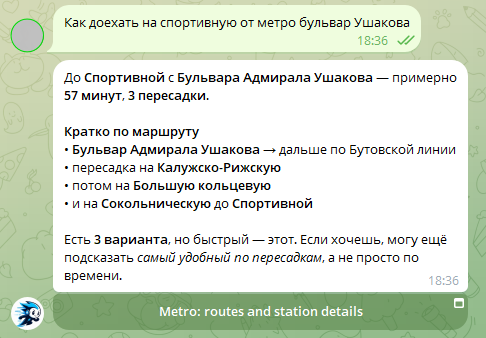
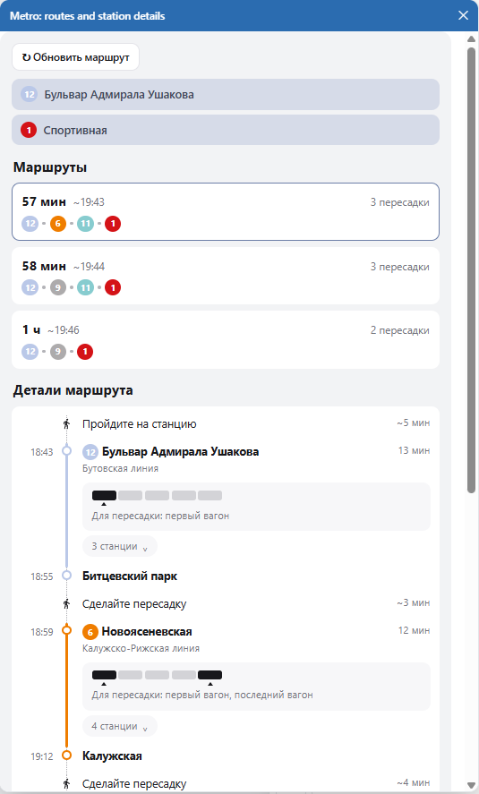

# MCP METRO

**Moscow Metro for AI agents.** Ask *"how do I get from Khovrino to Sportivnaya?"* in plain language — get real
route variants with travel times, transfers, car-boarding hints and today's closures. Works in Russian, English,
Arabic and Chinese. Typos welcome.

[](LICENSE)
[](https://nodejs.org/)
[](https://www.typescriptlang.org/)
[](https://modelcontextprotocol.io/)
[](https://modelcontextprotocol.io/)
[](https://github.com/Bazilio-san/fa-mcp-sdk)

<table>
  <tr>
    <td width="56%" valign="top"></td>
    <td width="44%" valign="top"></td>
  </tr>
  <tr>
    <td><sub>In any chat the agent calls one tool and retells the route in the user's language.</sub></td>
    <td><sub>Hosts with MCP Apps render a live widget instead of text — station selects, route cards, a timeline
    and a working "Refresh" button.</sub></td>
  </tr>
</table>

## What it does

- 🚇 **Routes people can actually follow** — up to 3 variants with travel time, every station on the way, transfer
  walks, a door-to-door estimate and "board the first car" hints for faster interchanges.
- 🚧 **Knows what's closed today** — escalator repairs, closed stations and official detours are applied to the
  route graph *before* the search runs, not footnoted after.
- 🌍 **Understands humans, not codes** — fuzzy station matching in four languages; typos, transliteration
  (`hovrino`) and Russian case forms (`до Чеховской`) all resolve to the right station.
- 🖼 **Interactive widget (MCP Apps)** — SEP-1865 hosts get clickable route cards; text-only hosts get clean
  Markdown. Nobody gets a wall of JSON.
- 🔄 **Swap stations right in the card** — pick another «from» or «to» from a searchable dropdown and the card
  recomputes the route in place, without asking the bot again.
- 🚈 **The whole network** — Metro, MCC and MCD, plus ground transport at both ends, station services and
  vestibule opening hours.
- ⚡ **Never hostage to the network** — a primary source, a backup source and an atomic disk cache, refreshed
  daily; the server answers within a second of starting.
- 🔌 **Every way in** — MCP over STDIO / HTTP / SSE, a rate-limited REST API with Swagger at `/docs`, and a
  built-in Agent Tester that drives the tool through a real LLM.

One tool — `metro_info` — answers the two questions a passenger asks: *how do I get from A to B*
(`search_route`) and *what is there at station X* (`get_station_info`).

## Try it in 60 seconds

```bash
npm install
npm run build
npm start            # HTTP mode → http://localhost:9049
```

```bash
curl http://localhost:9049/health
```

MCP endpoint: `http://localhost:9049/mcp`. No database, no API keys, no credentials — it just runs.
Client configs are one click away: [Connect your client](#connect-your-client) below.

## Documentation

| Topic                                                     | What's inside                                                                |
|-----------------------------------------------------------|------------------------------------------------------------------------------|
| [Getting Started](./readme-docs/getting-started.md)       | Install, run, connect MCP clients, transports, build & test commands         |
| [Tool Reference](./readme-docs/tool-reference.md)         | `metro_info` parameters and answers, MCP resources and prompts               |
| [Route Search](./readme-docs/route-search.md)             | The graph, Yen's algorithm, the time model, closures, operating hours        |
| [Station Resolution](./readme-docs/station-resolution.md) | Fuzzy matching in four languages, interchange-hub clustering, clarifications |
| [Route Widget](./readme-docs/route-widget.md)             | MCP Apps contract, signed links, in-card station selects, reverse proxy, CORS |
| [Data Sources](./readme-docs/data-sources.md)             | Primary/backup cascade, disk cache, refresh schedule, Telegram alerts        |
| [REST API](./readme-docs/rest-api.md)                     | Five read-only endpoints, rate limits, status codes, response shapes         |
| [Configuration](./readme-docs/configuration.md)           | Every setting, resolution order, environment variables                       |
| [Authentication](./readme-docs/authentication.md)         | JWT / Basic / permanent tokens, issuing tokens, what stays open              |
| [Testing](./readme-docs/testing.md)                       | Unit tests, MCP protocol tests, Agent Tester and the Headless API            |
| [Deployment](./readme-docs/deployment.md)                 | Docker + systemd, reverse proxy, the self-update loop                        |
| [Skills](./readme-docs/SKILLS.md)                         | Claude Code skills shipped with the project                                  |

## The tool, up close

One tool — `metro_info`, read-only. `action=search_route` builds up to 3 route variants between two stations;
`action=get_station_info` describes one station. Answers are English Markdown; station and line names are
localized to the user's language.

<details><summary><b>Parameters and what the answers contain</b></summary><br>

| Parameter              | Required   | Description                                                                                                                                                |
|------------------------|------------|------------------------------------------------------------------------------------------------------------------------------------------------------------|
| `first_metro_station`  | yes        | Departure station (for a route) or the station to describe. Any of the four languages, typos allowed — resolved by fuzzy search.                           |
| `second_metro_station` | for routes | Arrival station. Required for `action=search_route`, unused for `get_station_info`.                                                                        |
| `action`               | yes        | `search_route` — build routes between two stations; `get_station_info` — describe `first_metro_station`.                                                   |
| `city`                 | no         | `Moscow` (default) or `StPetersburg`. St. Petersburg data is not wired in yet: for now every value falls back to the Moscow dataset.                       |
| `language`             | no         | Language the user communicates in: `en` (default), `ru`, `ar` or `cn`. Station and line names are localized to it; all other response text is English.     |

A `search_route` answer contains: up to 3 route variants with travel time and a door-to-door estimate, the full
station sequence of every leg, transfers with "board the first car" hints, which legs run on MCD / MCC, ground
transport at both ends, advisories along the route, and the vestibule status of the departure hub.

A `get_station_info` answer contains: lines at the station, city exits with nearby ground transport, on-station
services, first and last train times per direction, available interchanges, and current advisories.

When a name is ambiguous the answer is a numbered list to choose from; for a route request with two ambiguous
names, both lists come at once.

</details>

Full reference, including MCP resources and prompts: [Tool Reference](./readme-docs/tool-reference.md).

## Connect your client

<details><summary><b>Claude Code</b> — <code>~/.claude.json</code></summary><br>

```json
{
  "mcpServers": {
    "mcp-metro": {
      "type": "http",
      "url": "http://localhost:9049/mcp",
      "headers": {
        "Authorization": "Bearer <jwt-token>"
      }
    }
  }
}
```

Omit the `headers` block entirely while authentication is off (the default).

</details>

<details><summary><b>Claude Desktop</b> — <code>claude_desktop_config.json</code>, STDIO or remote HTTP</summary><br>

**Option 1 — STDIO (local build, direct spawn):**

```json
{
  "mcpServers": {
    "mcp-metro": {
      "command": "node",
      "args": ["<path-to-project>/dist/src/start.js", "stdio"],
      "env": {}
    }
  }
}
```

**Option 2 — HTTP (remote server via `mcp-remote`):**

```json
{
  "mcpServers": {
    "mcp-metro": {
      "command": "npx",
      "args": [
        "-y",
        "mcp-remote@latest",
        "https://mcp-metro.time-gold.com/mcp",
        "--header",
        "Authorization:Bearer <jwt-token>",
        "--allow-http",
        "--transport",
        "http-only"
      ]
    }
  }
}
```

Important: in `--header` values there must be **no space** after the `:`. `"Authorization:Bearer abc"` is
correct, `"Authorization: Bearer abc"` is not.

</details>

<details><summary><b>Qwen Code</b> — <code>~/.qwen/settings.json</code></summary><br>

```json
{
  "mcpServers": {
    "mcp-metro": {
      "command": "npx",
      "args": [
        "-y",
        "mcp-remote@latest",
        "https://mcp-metro.time-gold.com/mcp",
        "--header",
        "Authorization:Bearer <jwt-token>",
        "--allow-http",
        "--transport",
        "http-only"
      ]
    }
  }
}
```

The same no-space-after-`:` rule applies to `--header` values.

</details>

<details><summary><b>OpenCode</b> — <code>opencode.json</code></summary><br>

```json
{
  "$schema": "https://opencode.ai/config.json",
  "mcp": {
    "mcp-metro": {
      "type": "remote",
      "url": "http://localhost:9049/mcp",
      "enabled": true,
      "headers": {
        "Authorization": "Bearer <jwt-token>"
      }
    }
  }
}
```

Omit the `headers` block entirely while authentication is off (the default).

</details>

<details><summary><b>Codex</b> — <code>~/.codex/config.toml</code></summary><br>

```toml
[mcp_servers.mcp-metro]
url = "https://mcp-metro.time-gold.com/mcp"
http_headers = { "Authorization" = "Bearer <jwt-token>" }
```

</details>

Transports, endpoints and STDIO mode: [Getting Started](./readme-docs/getting-started.md).

## Under the hood

TypeScript (ESM) on Node.js ≥ 20, built on [fa-mcp-sdk](https://github.com/Bazilio-san/fa-mcp-sdk) — server core,
transports, auth, Swagger and Agent Tester come from the SDK. Routing is Yen's k-shortest-paths over a weighted
graph rebuilt for the requested moment. Data lives in JSON on disk — no database.

## License

MIT © Michael Makarova. See [LICENSE](./LICENSE).
